# PromptVault

> **The Premier AI Prompt Marketplace** — Buy, sell, and discover high-converting, expertly engineered AI prompts for image and text generation models.

PromptVault is a full-stack, production-grade SaaS platform built for prompt engineers, AI artists, and digital creators to monetize their expertise. Engineered from the ground up for high availability, security, and developer ergonomics, PromptVault combines a sleek Next.js 15 interface with a high-concurrency asynchronous FastAPI backend. The platform ensures strict content protection, real-time payment verification via Stripe Checkout and webhooks, and scalable asset delivery through Cloudinary.

---

## Features

PromptVault provides a comprehensive, end-to-end marketplace experience tailored for digital goods monetization:

* **AI Prompt Marketplace:** Discover and explore curated prompt listings categorized across diverse AI models, themes, and use cases with rich search and filtering.
* **Buyer / Seller Authentication:** Secure role-based registration and login system with JWT bearer tokens separating seller monetization tools from buyer access.
* **Seller Dashboard:** Dedicated workspace for creators to track active listings, monitor revenue, and manage product offerings.
* **Prompt Listings:** Rich product listings featuring custom titles, dynamic pricing, category mapping, and structured full/short descriptions.
* **Image Gallery:** E-commerce style multi-image product showcases supporting primary cover artwork alongside reorderable secondary example renders.
* **Prompt Preview:** Public product overview pages showcasing capabilities and high-resolution galleries while keeping proprietary prompt text secured.
* **Prompt Security:** Server-enforced content protection guaranteeing that prompt text instructions and downloadable files remain completely redacted until purchase completion.
* **Purchase History:** Clean buyer dashboard listing all acquired prompts with permanent unlock status and direct access to downloaded files.
* **Stripe Checkout:** Seamless, frictionless payment processing via Stripe Checkout sessions supporting real-time transaction handling.
* **Stripe Webhooks:** Cryptographically verified webhook endpoints guaranteeing atomic order completion and instant access provisioning upon successful payment.
* **Prompt Unlocking:** Immediate, automatic reveal of prompt text and proprietary usage instructions on product detail pages immediately following purchase.
* **Download Prompt:** One-click plain text (`.txt`) file export for verified buyers and listing owners directly from the prompt view.
* **Profile Management:** Full creator profile customization allowing sellers and buyers to update display names, avatars, and biographical information.

---

## Tech Stack

PromptVault leverages a modern, type-safe, and highly performant architecture across every layer:

| Layer | Technology | Description |
| :--- | :--- | :--- |
| **Frontend** | **Next.js 15 (App Router)** | React framework utilizing server components, dynamic client routes, and optimized rendering. |
| **Styling & UI** | **Tailwind CSS v4 & shadcn/ui** | Utility-first styling combined with accessible, composable UI primitives and custom dark-mode aesthetics. |
| **State & Forms** | **TanStack Query & React Hook Form** | Asynchronous server-state caching, optimistic updates, and schema-validated form handling (`Zod`). |
| **Backend** | **FastAPI (Python 3.12+)** | High-performance asynchronous API framework with automatic OpenAPI documentation and strict type checking. |
| **Database ORM** | **SQLAlchemy 2.0 & Alembic** | Async data access layer using repository patterns, connection pooling, and automated schema migrations. |
| **Database** | **PostgreSQL 16** | Relational database engine supporting robust transactions, foreign key constraints, and JSONB indexing. |
| **Authentication** | **PyJWT & Passlib (Bcrypt)** | Stateless JSON Web Token authentication with secure password hashing and strict role verification. |
| **Payments** | **Stripe API & Webhooks** | PCI-compliant checkout flows and secure webhook event processing for order fulfillment. |
| **Image Storage** | **Cloudinary REST API** | Cloud-native media management providing secure asset upload, optimization, and CDN delivery. |
| **Containerization** | **Docker & Docker Compose** | Multi-stage container builds ensuring parity across local development, CI/CD, and production environments. |
| **CI/CD** | **GitHub Actions** | Automated continuous integration pipelines for linting, type verification, and end-to-end testing (`pytest`). |

---

## Architecture

PromptVault is structured around a decoupled client-server architecture. The Next.js frontend communicates exclusively via REST API endpoints with the FastAPI backend. The backend enforces business rules and authorization before interacting with PostgreSQL, Cloudinary, and Stripe.

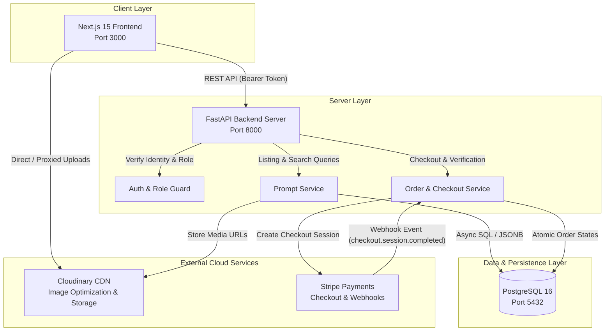

---

## Screenshots

Explore the PromptVault user experience across the marketplace, creator dashboard, and secure checkout flows:

### Landing Page
The public entrance of PromptVault showcasing value propositions, core features, and immediate calls-to-action for buyers and sellers.

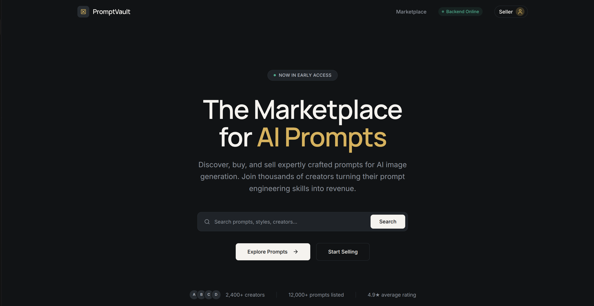

### Features Overview
A comprehensive breakdown of platform capabilities, highlighting role separation, secure prompt protection, and real-time payment processing.

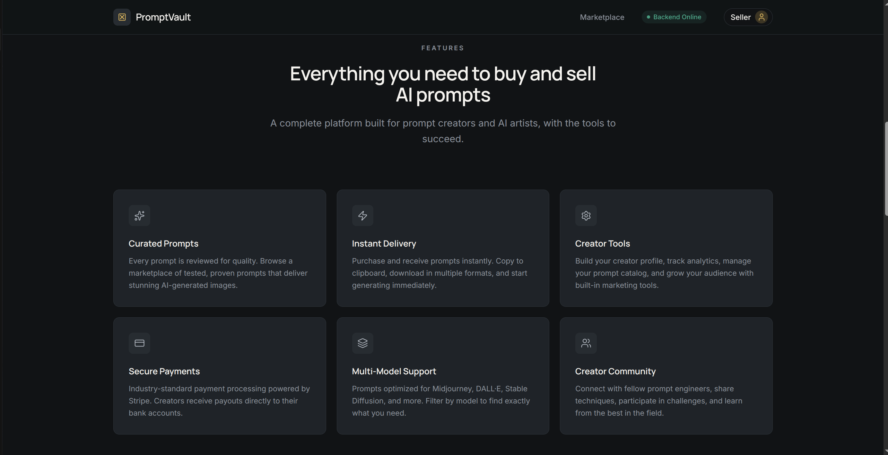

### Create Account
The onboarding interface allowing new users to register securely and select their initial platform role (Buyer or Seller).

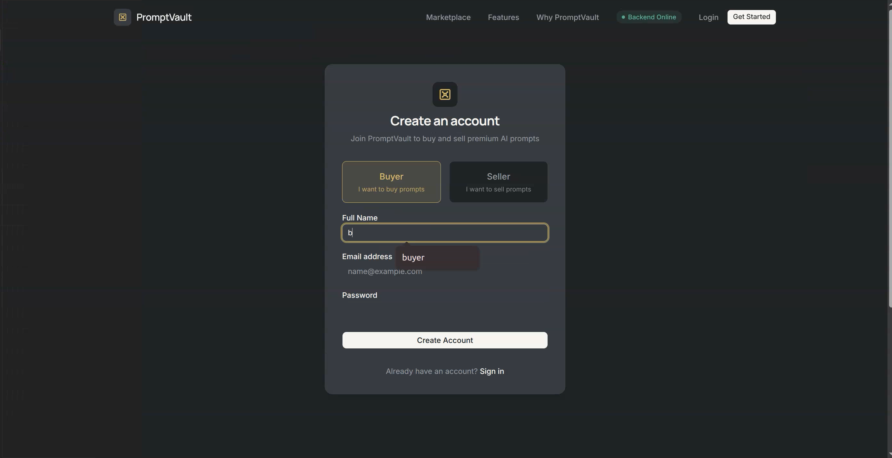

### Seller Dashboard
The creator workspace where prompt engineers manage their portfolio, track active listings, and monitor monetization metrics.

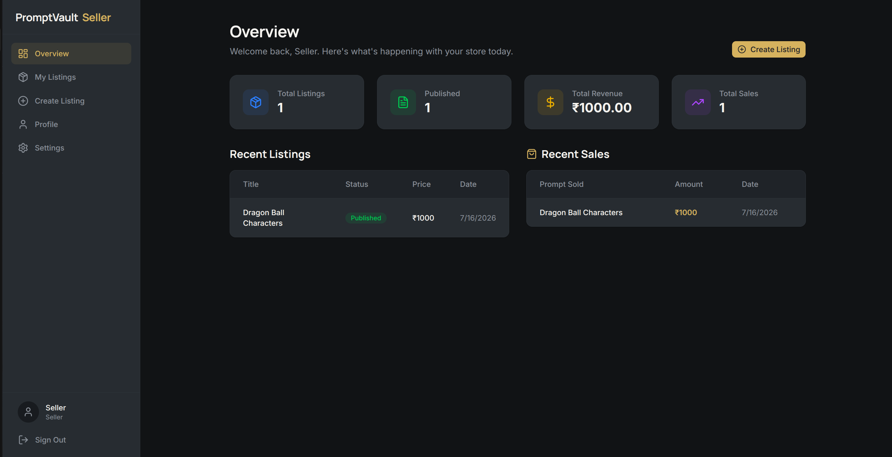

### Create Listing
The product creation form where sellers input prompt titles, select categories, define pricing, and upload primary cover artwork.

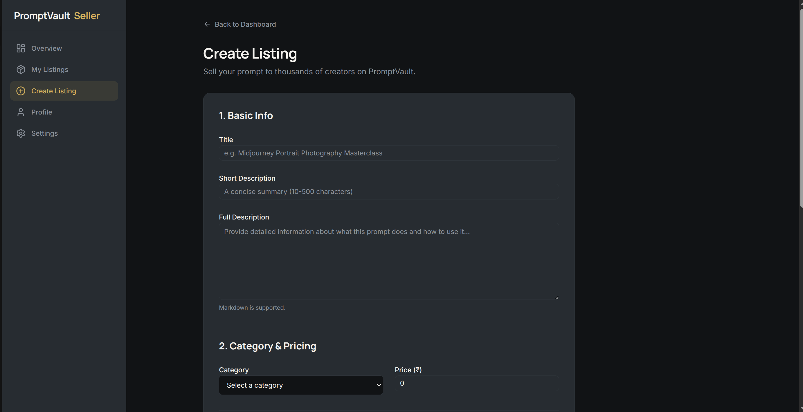

### Listing Editor & Gallery Images
The advanced product editor supporting multi-image e-commerce galleries (`additional_images`) alongside proprietary prompt instruction fields.

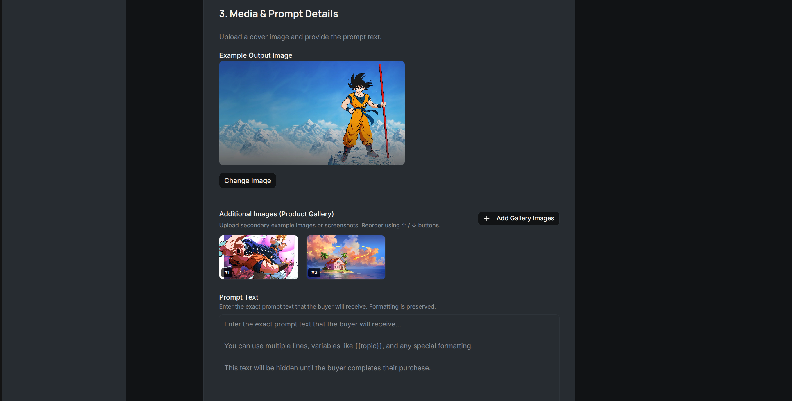

### Marketplace
The searchable, categorized product catalog where buyers browse, filter, and discover high-converting prompt listings.

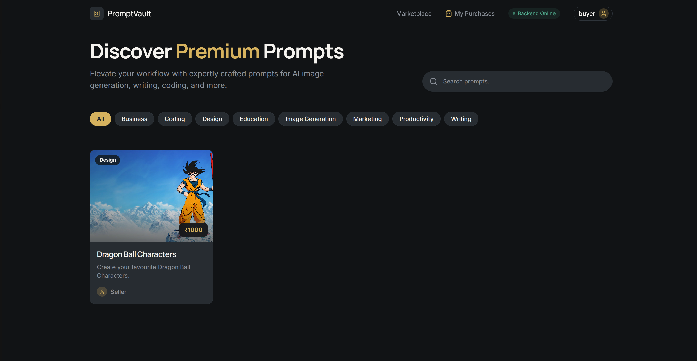

### Prompt Details
The public product overview page displaying full descriptions, pricing, metadata, and image showcases while protecting the underlying prompt text.

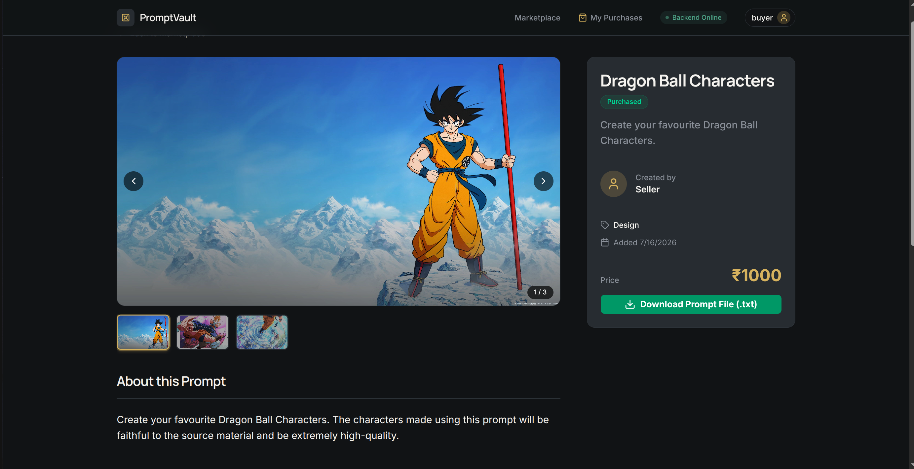

### Protected Prompt Before Purchase
The pre-purchase security state on the product page confirming that proprietary prompt instructions and downloadable `.txt` files remain server-gated.

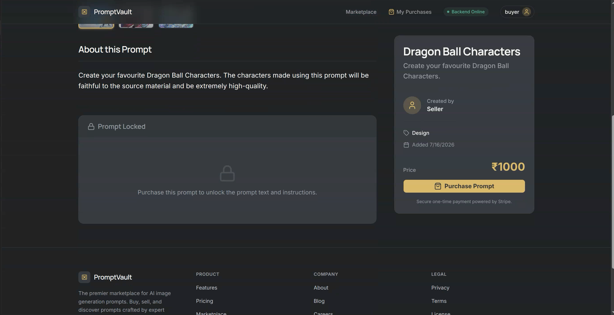

### Stripe Checkout
The secure, PCI-compliant Stripe payment portal where buyers complete instant checkout transactions for selected prompt listings.

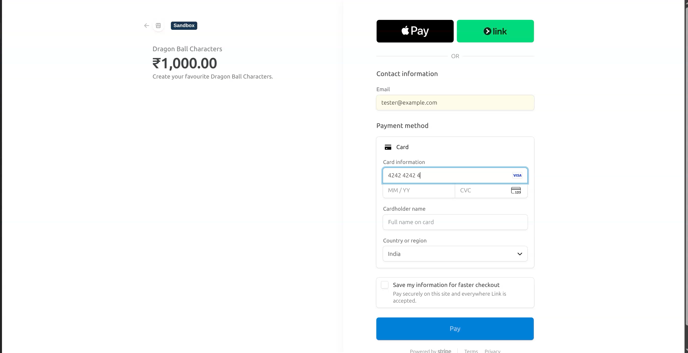

### Unlocked Purchased Prompt
The post-purchase product view where verified buyers gain immediate, permanent access to the unredacted prompt text and plain text file downloads.

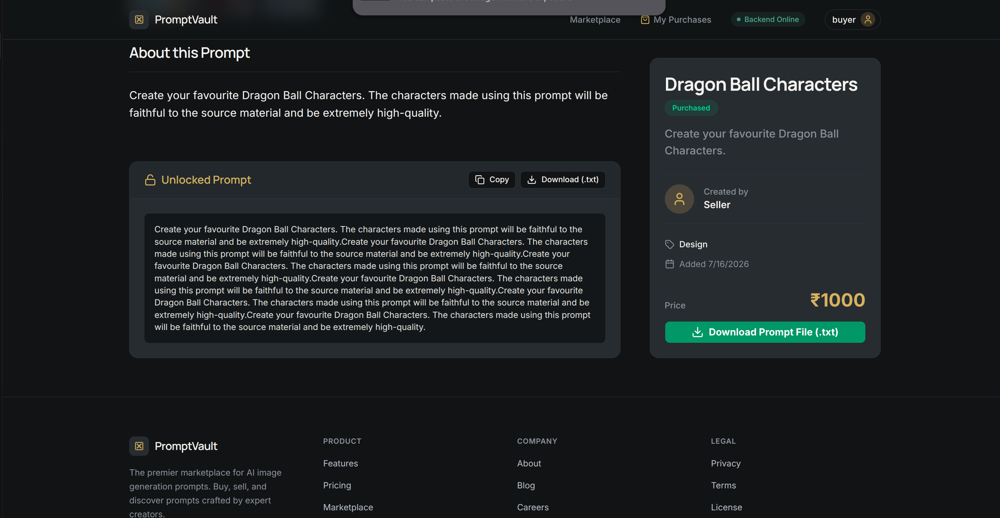

---

## Project Structure

```
PromptVault/
├── backend/
│   ├── alembic/                    # Database migration versions and scripts
│   ├── app/
│   │   ├── api/                    # API routers (auth, prompts, orders, users, categories)
│   │   ├── core/                   # Security settings, config parsing, and exception handlers
│   │   ├── db/                     # Async SQLAlchemy database session and engine setup
│   │   ├── integrations/           # Third-party integrations (Stripe client, Cloudinary service)
│   │   ├── middleware/             # Request logging and CORS configuration
│   │   ├── models/                 # SQLAlchemy ORM models (User, Prompt, Order, OrderItem, Payment)
│   │   ├── repositories/           # Data access repository layer isolating SQL queries
│   │   ├── schemas/                # Pydantic v2 validation models and serializers
│   │   └── services/               # Core business logic and transaction management
│   ├── scripts/                    # Utility scripts (reset_demo_data, seed_categories)
│   ├── tests/                      # Comprehensive pytest suite (auth, orders, prompts, workflows)
│   └── requirements.txt            # Python dependencies
├── frontend/
│   ├── src/
│   │   ├── app/                    # Next.js 15 App Router pages and layouts
│   │   │   ├── (protected)/        # Authenticated routes (dashboard, create, edit, profile)
│   │   │   ├── auth/               # Login and registration flows
│   │   │   ├── marketplace/        # Buyer order history and status screens
│   │   │   └── prompt/[id]/        # Product detail, image gallery, and unlock screen
│   │   ├── components/             # Reusable UI components (Navbar, PromptCard, UI library)
│   │   ├── hooks/                  # Custom React hooks for API interaction and state
│   │   ├── lib/                    # HTTP client, authentication utilities, and helpers
│   │   ├── providers/              # Auth and React Query context providers
│   │   └── types/                  # TypeScript interfaces and API response schemas
│   ├── next.config.ts              # Next.js configuration
│   └── package.json                # Node.js dependencies and build scripts
├── docker/
│   ├── backend.Dockerfile          # Multi-stage optimized build for FastAPI server
│   └── frontend.Dockerfile         # Multi-stage optimized build for Next.js web application
├── docs/
│   ├── architecture.md             # Detailed technical architecture notes
│   └── images/                     # Screenshot assets for documentation
├── docker-compose.yml              # Local development and container orchestration
└── .env.example                    # Environment variable configuration template
```

---

## Local Setup

Follow these instructions to get PromptVault up and running on your local machine in minutes.

### 1. Clone the Repository

```bash
git clone https://github.com/your-username/PromptVault.git
cd PromptVault
```

### 2. Environment Variables

Create your local `.env` file from the provided template:

```bash
cp .env.example .env
```

Ensure your `.env` contains the required placeholders or active credentials before starting the application. See the [Environment Variables](#environment-variables) reference below.

### 3. Docker Setup (Recommended)

PromptVault is container-first. You can launch the full stack (PostgreSQL database, FastAPI backend, and Next.js frontend) using Docker Compose:

```bash
# Build and start all services in detached mode
docker compose up --build -d

# Check running containers and health status
docker compose ps
```

Once running, access the local services at:
* **Frontend Application:** [http://localhost:3000](http://localhost:3000)
* **Backend API Documentation (Swagger UI):** [http://localhost:8000/docs](http://localhost:8000/docs)
* **Backend Health Check:** [http://localhost:8000/api/health](http://localhost:8000/api/health)

### 4. Database Setup & Migrations

If running inside Docker, Alembic migrations apply automatically on startup. To manually execute migrations or reset demo data:

```bash
# Run database migrations to head
docker compose exec backend alembic upgrade head

# Seed initial marketplace prompt categories
docker compose exec backend python -m scripts.seed_categories

# (Optional) Wipe transactional data while preserving users and categories
docker compose exec backend python -m scripts.reset_demo_data
```

### 5. Local Development Run Commands

If you prefer running services outside of Docker for active debugging:

#### Backend Server (Local Python Virtual Environment)
```bash
cd backend
python3 -m venv .venv
source .venv/bin/activate
pip install -r requirements.txt

# Launch FastAPI development server with hot reload
uvicorn app.main:app --reload --host 0.0.0.0 --port 8000
```

#### Frontend Server (Local Node.js Environment)
```bash
cd frontend
npm install

# Launch Next.js development server with hot reload
npm run dev
```

---

## Environment Variables

Configure the following variables in your `.env` file located at the root of the project. **Never commit actual API keys or secrets to version control.**

| Variable | Placeholder / Default | Description |
| :--- | :--- | :--- |
| `DATABASE_URL` | `postgresql+asyncpg://user:pass@db:5432/promptvault` | Async SQLAlchemy connection string for PostgreSQL. |
| `POSTGRES_USER` | `promptvault` | PostgreSQL database administrator username. |
| `POSTGRES_PASSWORD` | `your-secure-password` | PostgreSQL database administrator password. |
| `POSTGRES_DB` | `promptvault` | PostgreSQL target database name. |
| `APP_ENV` | `development` | Application runtime environment (`development`, `staging`, `production`). |
| `APP_DEBUG` | `true` | Toggle detailed exception tracebacks and API logging (`true` or `false`). |
| `BACKEND_URL` | `http://localhost:8000` | Internal server origin URL for webhook verifications and absolute links. |
| `FRONTEND_URL` | `http://localhost:3000` | Frontend client origin URL used for checkout success/cancel redirects. |
| `CORS_ORIGINS` | `["http://localhost:3000"]` | JSON array of permitted cross-origin resource sharing (CORS) origins. |
| `JWT_SECRET` | `your-256-bit-secret-key-here` | Secret cryptographic key used to sign and verify JSON Web Tokens. |
| `JWT_ALGORITHM` | `HS256` | Cryptographic signing algorithm for JWT tokens. |
| `JWT_EXPIRATION_MINUTES`| `30` | Access token lifespan in minutes before expiration. |
| `CLOUDINARY_CLOUD_NAME` | `your_cloud_name` | Cloudinary account unique cloud identifier for image assets. |
| `CLOUDINARY_API_KEY` | `123456789012345` | Cloudinary REST API public access key. |
| `CLOUDINARY_API_SECRET` | `your_cloudinary_api_secret` | Cloudinary REST API secret signing key. |
| `STRIPE_SECRET_KEY` | `sk_test_51...` | Stripe secret API key used for backend checkout session creation. |
| `STRIPE_PUBLISHABLE_KEY`| `pk_test_51...` | Stripe publishable key for client-side integrations. |
| `STRIPE_WEBHOOK_SECRET` | `whsec_...` | Stripe webhook signing secret to verify payload authenticity. |
| `NEXT_PUBLIC_API_URL` | `http://localhost:8000` | Public backend API URL consumed by the Next.js frontend client. |

---

## Feature Highlights

### Role-Based Authentication
PromptVault enforces clear separation between buyers and sellers. Sellers gain access to specialized management dashboards (`/dashboard/create`, `/dashboard/listings`), revenue tracking, and prompt publishing tools. Buyers get dedicated purchase history views (`/marketplace/orders`), secure checkout flows, and instant access to unlocked assets upon order fulfillment.

### Secure Prompt Unlocking
To prevent intellectual property leakage, all prompt listings are split into public and protected slices. Public attributes (titles, descriptions, pricing, preview galleries) are accessible to all visitors. Proprietary content (`prompt_text`) is strictly gated by backend service logic and never sent across the wire until database verification confirms ownership or verified purchase.

### Stripe Checkout
When a buyer initiates a purchase, the backend generates a secure Stripe Checkout session tied directly to the `prompt_id` and `buyer_id`. Buyers are redirected to Stripe's hosted payment portal, ensuring full PCI compliance and zero credit card handling on local application servers.

### Stripe Webhooks
Payment verification operates asynchronously via Stripe webhooks (`/api/orders/webhook`). Upon receiving a `checkout.session.completed` event, the backend verifies the Stripe signature (`STRIPE_WEBHOOK_SECRET`), transitions the order state to `completed`, and records atomic payment entries in the database—guaranteeing instant prompt access without polling or race conditions.

### Cloudinary Uploads
Image management for prompt listings uses Cloudinary API abstractions. Sellers can upload primary cover images along with multiple supporting example renders. The backend stores full asset URLs and preserves custom display ordering (`additional_images` JSON array), enabling sleek e-commerce galleries with instant thumbnail switching.

### Marketplace Architecture
Built with a layered repository and service pattern, the application decouples data storage from business rules and HTTP controllers. Pagination, search queries, and filtering across prompt listings are handled efficiently inside PostgreSQL (`PaginatedPromptRead`), keeping API response times consistently fast under concurrency.

---

## Security

PromptVault is designed around defense-in-depth principles:

* **JWT Authentication:** Stateless bearer tokens signed with HMAC-SHA256 (`HS256`) protect all sensitive user endpoints, preventing session hijacking or tampering.
* **Protected APIs:** Every sensitive FastAPI route enforces strict dependency injection checks (`get_current_user`, `RoleChecker`), blocking unauthorized requests before handler logic executes.
* **Role-Based Authorization:** Sellers cannot modify listings they do not own, and buyers cannot access creator endpoints or delete product records.
* **Backend Prompt Protection:** The backend serves as the single source of truth. Serializers (`PromptRead`) dynamically redact `prompt_text` to `null` on every request unless `OrderRepository.has_purchased_prompt()` returns true or the requester is the verified seller.
* **Stripe Webhook Verification:** Incoming webhook payloads are validated against Stripe's cryptographic signature headers using `stripe.Webhook.construct_event()`, mitigating replay attacks or forged payment confirmations.

---

## Roadmap

### Completed: PromptVault v1.0
* [x] Core marketplace listings, categorization, and search.
* [x] Role-based JWT authentication and profile management.
* [x] Seller dashboard with listing creation, editing, and deletion.
* [x] Multi-image e-commerce product gallery (`additional_images`).
* [x] Server-enforced prompt text security and redaction logic.
* [x] Stripe Checkout session integration and automated webhook verification.
* [x] One-click `.txt` file export and download protection.
* [x] Full Docker Compose containerization and CI/CD test automation.

### Future Plans
* [ ] **Reviews & Ratings:** Verified buyer review system with 5-star ratings and written feedback.
* [ ] **Wishlist & Bookmarks:** Ability for buyers to save favorite prompts to custom collections.
* [ ] **Advanced Search & Filtering:** Full-text vector search across prompt descriptions and tags.
* [ ] **AI Recommendations:** Personalized prompt suggestions based on user browsing and purchase history.
* [ ] **Curated Collections:** Themed prompt bundles and multi-listing creator packs with tiered discounts.
* [ ] **Creator Analytics:** Granular seller revenue charts, conversion rates, and traffic insights.
* [ ] **Admin Dashboard:** Platform moderation panel for reporting listings, managing categories, and monitoring transactions.

---

## License

This project is open-source and available under the **[MIT License](LICENSE)**.

---

## Author

**PromptVault Engineering Team**

* **GitHub:** [@your-username](https://github.com/your-username)
* **LinkedIn:** [Your Professional Profile](https://linkedin.com/in/your-profile)
* **Portfolio:** [https://your-portfolio.dev](https://your-portfolio.dev)

---
*Built with ❤️ using Next.js 15, FastAPI, PostgreSQL, and Stripe.*
