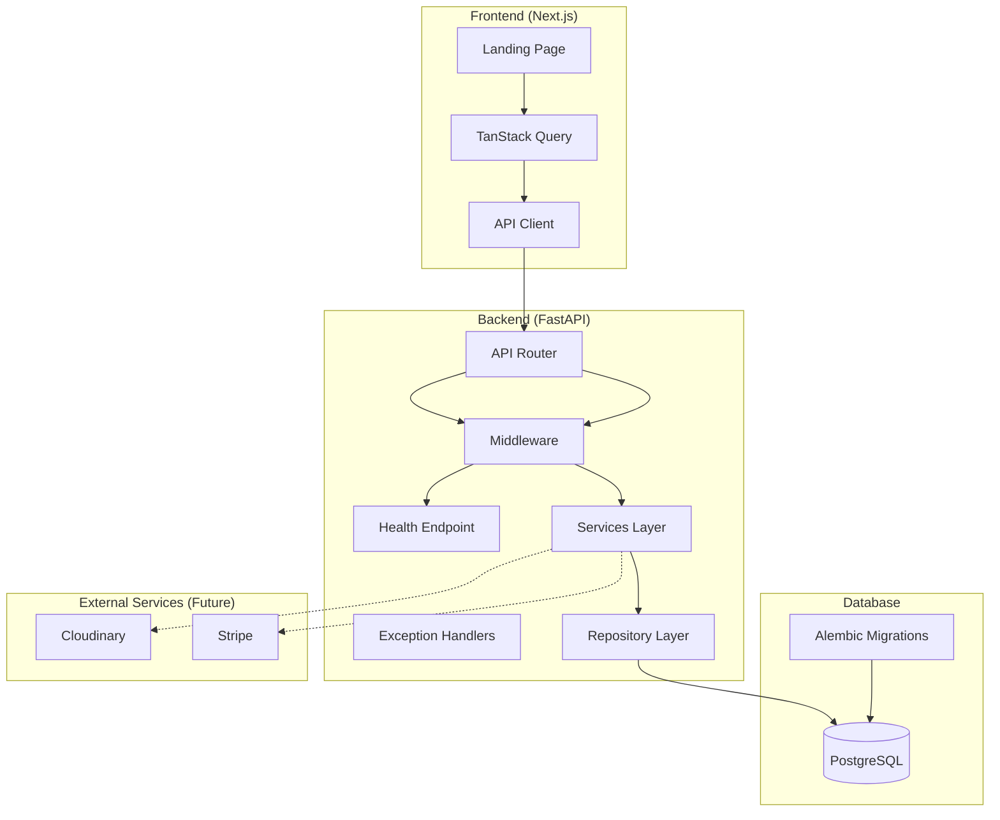
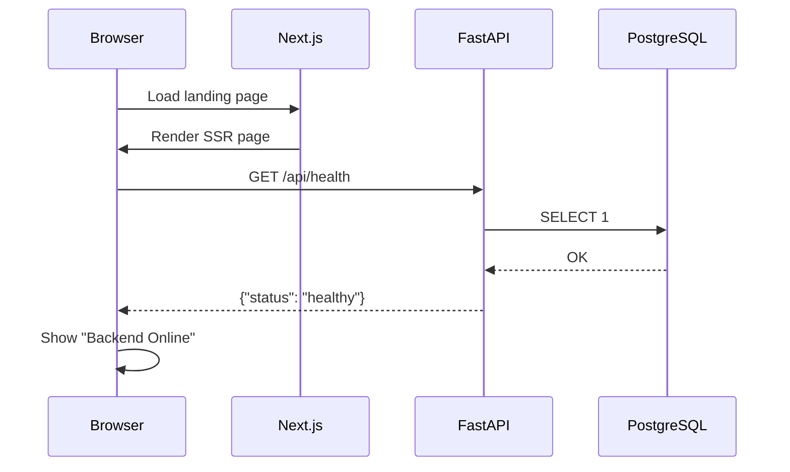

# PromptVault Architecture

## System Overview

## Backend Architecture

The backend follows a layered architecture:

| Layer | Responsibility |
|-------|---------------|
| **API** | Route definitions, request/response handling |
| **Services** | Business logic orchestration |
| **Repositories** | Data access and persistence |
| **Models** | SQLAlchemy ORM models |
| **Schemas** | Pydantic validation schemas |
| **Core** | Configuration, exceptions, response format |
| **Integrations** | Third-party service abstractions |
| **Middleware** | Cross-cutting concerns (logging, etc.) |

## Frontend Architecture

The frontend uses feature-based organization:

| Directory | Purpose |
|-----------|---------|
| **app/** | Next.js App Router pages and layouts |
| **components/ui/** | shadcn/ui primitives |
| **components/layout/** | Navbar, footer, page shells |
| **components/shared/** | Reusable cross-feature components |
| **features/** | Feature-specific components |
| **hooks/** | Custom React hooks |
| **services/** | API service functions |
| **lib/** | Utilities, clients, configuration |
| **types/** | TypeScript type definitions |
| **providers/** | React context providers |

## Data Flow

